# Linux Sysadmin Project 02 – Nginx Demo

This project demonstrates the installation and configuration of an Nginx web server on Ubuntu, including SSL with a self-signed certificate.  
It was created as part of a system administration learning project.

---

## Project Steps with Screenshots

### 1. Check Nginx status
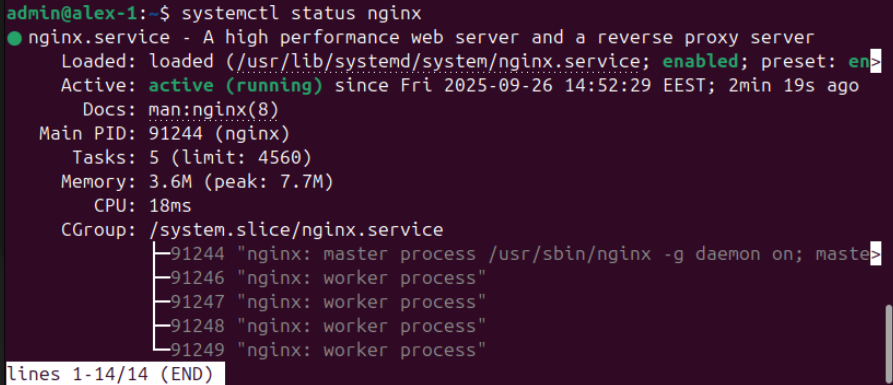

### 2. Configure UFW firewall rules
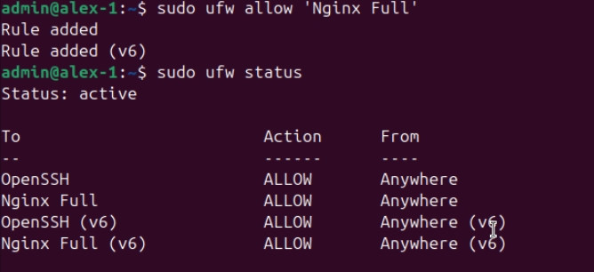

### 3. Verify Nginx welcome page
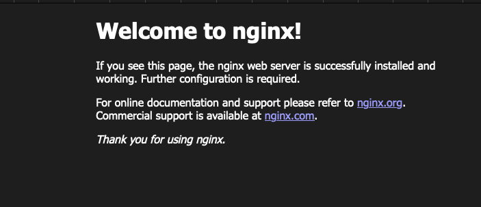

### 4. Configure Nginx demo site
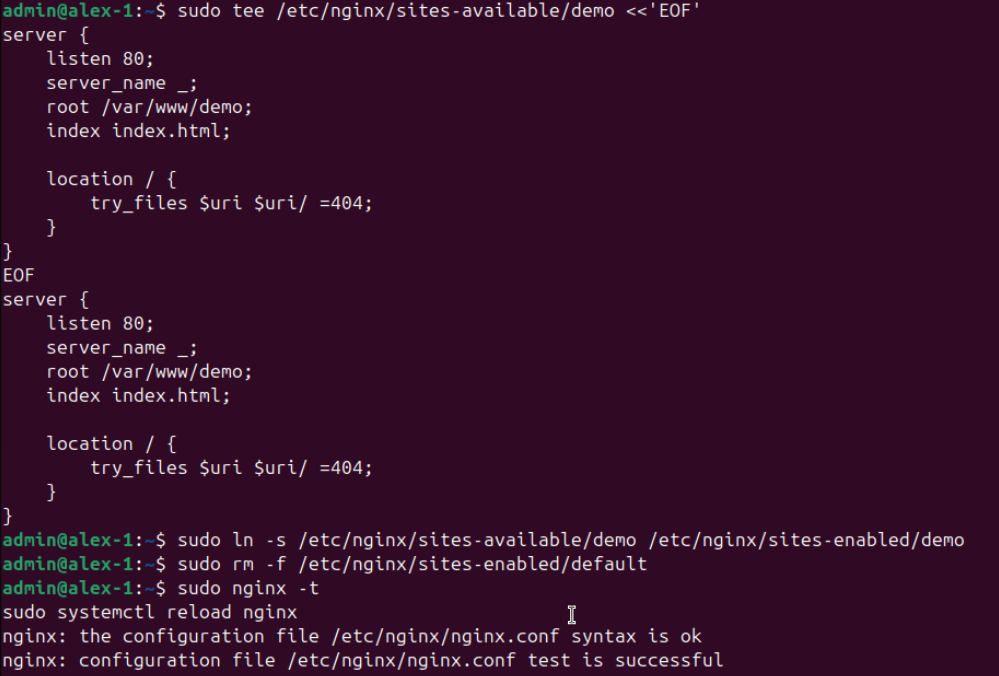

### 5. Add hosts file entry
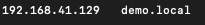

### 6. Browser SSL warning
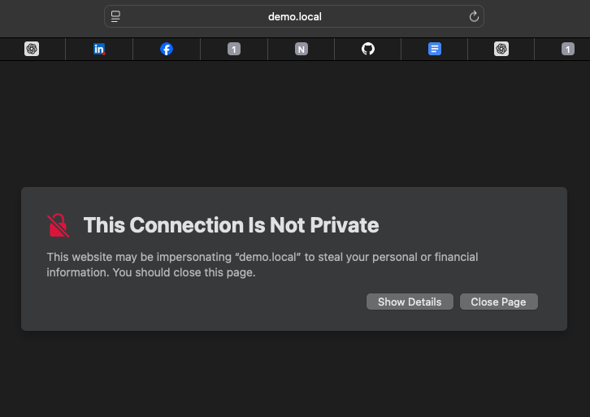

### 7. Check server IP address
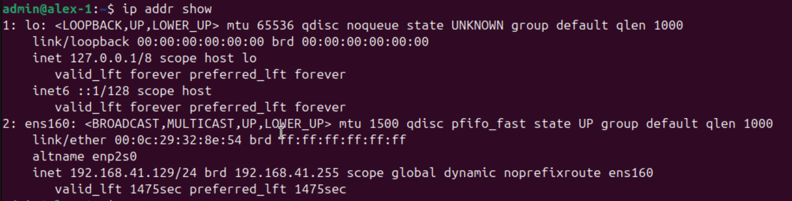

### 8. Configure Nginx SSL
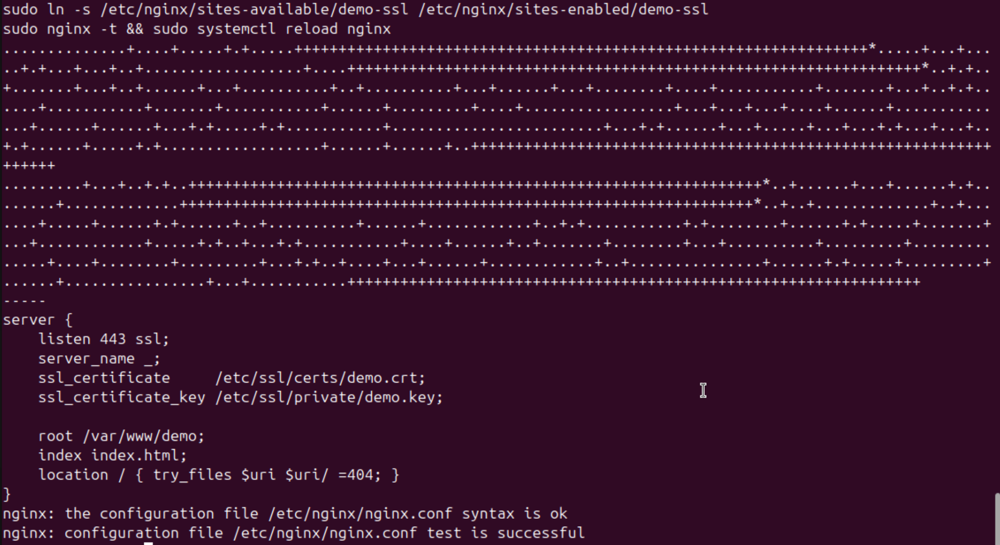

### 9. Set permissions with chown & chmod
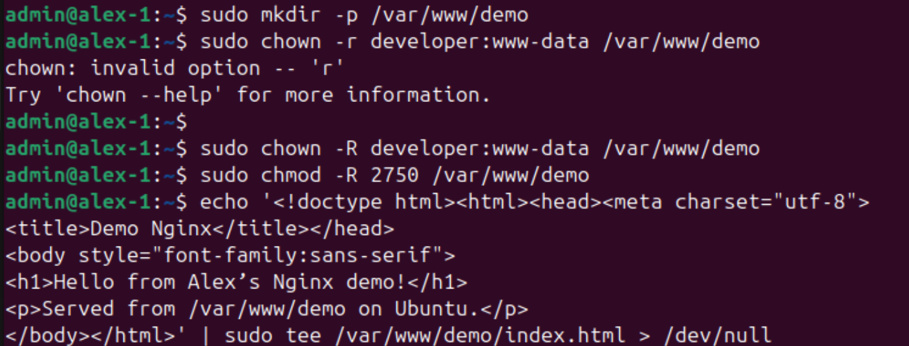

### 10. Create index.html
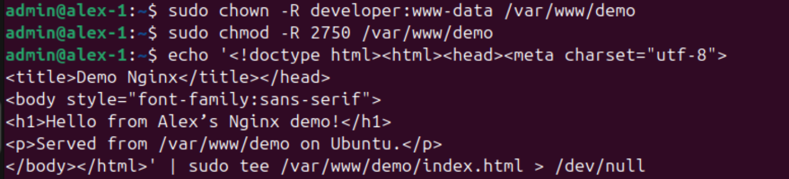

### 11. Verify /var/www permissions
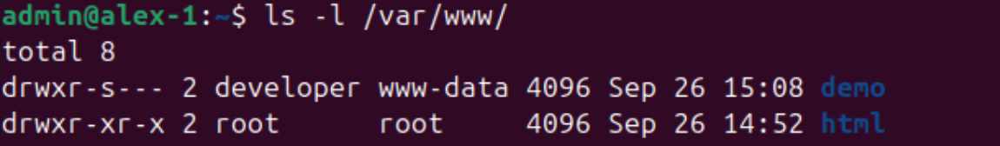

